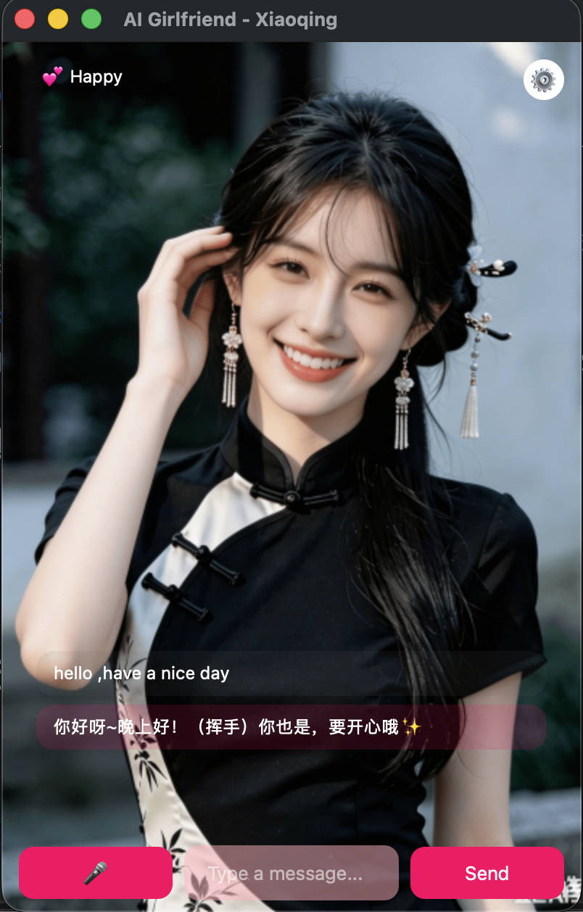

# LocalAIAssistant

[中文](README.md) | **English**

A cross-platform AI assistant desktop application based on Qt 6, supporting both GUI and CLI modes, with a built-in AI Girlfriend voice interaction module.



## Features

### Core Features
- **Dual Mode Support** — GUI interface + CLI command line
- **File Upload** — Support for text, image, and PDF file attachments
- **Streaming Output** — SSE real-time display, AI responses appear character by character
- **Session Management** — Multi-session switching, history persistence
- **Multi-language** — Simplified Chinese / English switching
- **Theme Switching** — Light / Dark / Follow System
- **Cross-platform** — macOS / Windows / Linux (Linux not tested)

### AI Girlfriend Module 🎀
- **Independent Window** — Immersive full-screen avatar background
- **Emotion System** — 11 expressions real-time switching (happy, shy, loving, playful, etc.)
- **Memory System** — Automatically records user information via text markers, long-term memory persistence
- **Voice Interaction** — Voice input (ASR) + Voice output (TTS)
- **Personality Customization** — Modify personality.md to customize character
- **Shortcut Key** — Command/Ctrl+G to quickly open/close girlfriend window

> ⚠️ **Platform Compatibility**:
> - **macOS**: Full voice input/output support ✅
> - **Windows**: Voice output (TTS) works normally, voice input (ASR) not supported ⚠️
> - **Linux**: Author has no Linux laptop, not tested yet

## Tech Stack

| Item | Technology |
|------|------------|
| Language | C++17 |
| Framework | [Qt 6.x](https://www.qt.io) (Widgets, Network, Multimedia, WebSockets) |
| Build | [CMake](https://cmake.org) 3.16+ |
| PDF Parsing | [Poppler](https://poppler.freedesktop.org) 26.x (PDF upload not supported if not installed) |
| Voice Service | [iFlytek Open Platform](https://www.xfyun.cn) (WebSocket API) |

## Project Structure

```
sourcecode-ai-assistant/
├── src/
│   ├── core/           # Core business logic (network, session, file handling)
│   ├── ui/             # GUI interface (main window, settings dialog)
│   ├── cli/            # CLI command line interface
│   └── girlfriend/     # AI Girlfriend module
│       ├── girlfriendwindow.cpp  # Girlfriend window
│       ├── avatarwidget.cpp       # Avatar/expression component
│       ├── personalityengine.cpp  # Personality engine, emotion detection
│       ├── voicemanager.cpp       # Voice management (iFlytek ASR/TTS)
│       ├── memorymanager.cpp      # Long-term memory management
│       ├── personality.md         # Personality Prompt (customizable)
│       └── voice_config.json      # Voice configuration template
├── AIGirlfriend/       # Expression image resources (11 images)
├── scripts/            # Build scripts
│   ├── build.sh        # Unified cross-platform build script
│   └── setup.sh        # First-time clone initialization script
├── translations/       # Internationalization translation files
├── resources/          # Resource files (icons, configs)
├── cmake/              # CMake configuration templates
├── .gitattributes      # Git line ending configuration
├── .env.example        # iFlytek voice credential template
└── README.md           # Project documentation
```

---

## Build Steps

### 1. Install Dependencies

| Software | Version | macOS | Windows | Linux |
|----------|---------|-------|---------|-------|
| C++ Compiler | C++17 | Xcode CLT | MinGW (Qt bundled) or MSVC | GCC 9+ |
| Qt | 6.x | Official or [Homebrew](https://brew.sh) | Official (MinGW or MSVC) | Package Manager |
| Qt Multimedia | ⚠️ Extra selection | Homebrew auto-install | Qt Maintenance Tool select | `qt6-multimedia-dev` |
| Qt WebSockets | ⚠️ Extra selection | Homebrew auto-install | Qt Maintenance Tool select | `qt6-websockets-dev` |
| CMake | 3.16+ | `brew install cmake` | [Official Download](https://cmake.org/download/) | `sudo apt install cmake` |
| Poppler | 26.x | `brew install poppler` | [MSYS2](https://www.msys2.org) or [vcpkg](https://vcpkg.io) | `sudo apt install poppler` |

> **Qt Module Note**: Multimedia and WebSockets need to be manually selected in Qt Maintenance Tool (required for voice features)

#### macOS Quick Install

```bash
# Install Xcode Command Line Tools
xcode-select --install

# Install Homebrew (if not installed)
# See: https://brew.sh

# Install dependencies (qt@6 includes Multimedia and WebSockets)
brew install cmake qt@6 poppler

# Note: For official Qt installation, manually select Multimedia and WebSockets in Maintenance Tool
```

#### Linux Quick Install (Ubuntu/Debian)

```bash
sudo apt update
sudo apt install build-essential cmake qt6-base-dev qt6-base-dev-tools qt6-multimedia-dev qt6-websockets-dev libpoppler-cpp-dev
```

#### Windows Quick Install

**Option 1: MinGW (Recommended, no Visual Studio needed)**

1. Install **[Git for Windows](https://git-scm.com/download/win)** (includes Git Bash)
2. Install **[CMake](https://cmake.org/download/)**
3. Install **[Qt 6](https://www.qt.io/download)**:
   - Select `Qt 6.x.x for MinGW 11.2 64-bit` (Qt bundles compiler, no extra Visual Studio needed)
   - ⚠️ **Important**: Manually select **Qt Multimedia** and **Qt WebSockets** in Qt Maintenance Tool (required for voice features)
4. Install **Poppler**: via [MSYS2](https://www.msys2.org) (`pacman -S poppler`) or [vcpkg](https://vcpkg.io)

**Option 2: MSVC (Requires Visual Studio)**

1. Install **[Visual Studio 2019+](https://visualstudio.microsoft.com)** (with C++ development tools)
2. Install **[CMake](https://cmake.org/download/)**
3. Install **[Qt 6](https://www.qt.io/download)**:
   - Select `Qt 6.x.x for MSVC 2019 64-bit`
   - ⚠️ **Important**: Manually select **Qt Multimedia** and **Qt WebSockets** in Qt Maintenance Tool (required for voice features)
4. Install **Poppler**: via [MSYS2](https://www.msys2.org) or [vcpkg](https://vcpkg.io)

> **Tip**: MinGW version is lighter, Qt installer bundles compiler; MSVC version has better debugging experience.

### 2. Build Project

```bash
cd scripts
./build.sh
```

> **Windows Note**:
> - Must run in **Git Bash** (bundled with Git for Windows)
> - Script auto-detects Qt and MinGW compiler paths, no manual environment variable setup needed

### Build Options

```bash
# Clean rebuild
./build.sh -c

# Debug build
./build.sh -d

# Specify Qt path
./build.sh -q /path/to/qt

# Build CLI only
./build.sh LocalAIAssistant-CLI

# Build GUI only
./build.sh LocalAIAssistant

# Show help
./build.sh help
```

### Build Artifacts

| Platform | GUI | CLI |
|----------|-----|-----|
| macOS | `build/LocalAIAssistant.app` | `build/LocalAIAssistant-CLI` |
| Windows | `build/LocalAIAssistant.exe` | `build/LocalAIAssistant-CLI.exe` |
| Linux | `build/LocalAIAssistant` | `build/LocalAIAssistant-CLI` |

---

## Usage

### Run GUI Version

```bash
# macOS
open build/LocalAIAssistant.app

# Windows
build\LocalAIAssistant.exe

# Windows debug mode (shows log console)
build\LocalAIAssistant.exe --debug

# Linux
./build/LocalAIAssistant
```

> **Windows Debug Tip**: Use `--debug` flag to show debug console window for viewing logs. Can also set environment variable `LOCALAI_DEBUG=1`.

### Run CLI Version

```bash
# macOS / Linux
./build/LocalAIAssistant-CLI

# Windows (Git Bash)
./build/LocalAIAssistant-CLI.exe

# Windows (CMD/PowerShell)
build\LocalAIAssistant-CLI.exe
```

**CLI Command Examples**:

```bash
# Enter interactive chat
./build/LocalAIAssistant-CLI chat

# Single query
./build/LocalAIAssistant-CLI ask "What is artificial intelligence?"

# Session management
./build/LocalAIAssistant-CLI sessions -l    # List sessions
./build/LocalAIAssistant-CLI sessions -n    # New session

# Configuration management
./build/LocalAIAssistant-CLI config --show-config
./build/LocalAIAssistant-CLI config --api-url "http://127.0.0.1:11434"
```

### CLI Interactive Commands

Available in CLI chat mode:

| Command | Function |
|---------|----------|
| `/help` | Show help |
| `/new` | New session |
| `/list` | List all sessions |
| `/switch <id>` | Switch session |
| `/delete <id>` | Delete session |
| `/config` | Show configuration |
| `/file <path>` | Add file attachment |
| `/listfiles` | View pending files |
| `/clearfiles` | Clear file list |
| `/exit` | Exit program |

---

## Configure AI Service

The program needs to connect to an AI service to work.

### Local Deployment: [Ollama](https://ollama.com/download) (Some features may not work)

1. Download and install Ollama: https://ollama.com/download
2. Download model: `ollama pull llama3`
3. Configure in program settings:
   - API URL: `http://127.0.0.1:11434`
   - Model name: `llama3`

### Use Cloud API (Recommended, Verified)

| Service | API URL | Description |
|---------|---------|-------------|
| [OpenAI](https://openai.com) | `https://api.openai.com` | Requires API Key |
| [Paratera](https://www.paratera.com) | `https://llmapi.paratera.com` | China API proxy service |
| Other OpenAI compatible services | Configure per provider docs | — |

---

## AI Girlfriend Module Configuration

The AI Girlfriend module provides voice interaction experience, requires iFlytek voice service configuration.

### Step 1: Register [iFlytek Open Platform](https://www.xfyun.cn) Account

1. Visit iFlytek Open Platform: https://www.xfyun.cn
2. Register and login
3. Go to "Console" → "Create Application"

### Step 2: Enable Voice Services

Enable the following services in your application:

| Service | Name | Purpose |
|---------|------|---------|
| **Voice Dictation (Recognition)** | Streaming (WebSocket) | Speech to text |
| **Voice Synthesis** | Ultra-realistic (WebSocket) | Text to speech |

### Step 3: Get API Credentials

After creating application, get three credentials from console:

```
APPID     - Application ID
API Key   - API Key
API Secret - API Secret
```

### Step 4: Configure Credentials

Create `.env` file in project root:

```bash
# Copy template
cp .env.example .env

# Edit and fill in your credentials
```

`.env` file content:
```
XFYUN_APP_ID=your_app_id
XFYUN_API_KEY=your_api_key
XFYUN_API_SECRET=your_api_secret
```

> **Security Note**: `.env` file is in `.gitignore`, won't be committed to Git.

### TTS Voice Selection

Modify `.env` to select different voice tones:

| Voice Parameter | Name | Characteristics |
|-----------------|------|-----------------|
| `x6_wumeinv_pro` | Wumei Sister | Natural, rich emotion ⭐Recommended, needs manual addition |
| `x6_lingfeiyi_pro` | Lingfeiyi | Youthful warm, male voice ⭐Recommended, included after enabling |

---

## Using AI Girlfriend Module

### Open AI Girlfriend Window

Select "AI Girlfriend" from View menu, or use shortcut `Ctrl/Cmd+G`.

### Voice Interaction Flow

```
1. Click 🎤 button to start recording (button turns red 🔴)
2. Speak into microphone
3. Click button again to stop recording
4. Wait for recognition, text auto-sent
5. AI response auto-played via voice
```

> **Windows Users Note**: Voice input (ASR) currently not available on Windows. You can still use text input, voice output (TTS) works normally.

### Customize Personality

Edit `src/girlfriend/personality.md` to customize AI girlfriend's personality and response style.
Rebuild or copy file to application resource directory after modification.

### Memory System Mechanism

AI girlfriend's memory system is implemented via text markers (defined in personality.md through system prompt, **memory system code not recommended to remove**), no API tool calls needed.

---

## Dependency Installation Supplement

### Qt 6 Multimedia and WebSockets Modules

AI girlfriend voice features require Qt Multimedia (audio recording/playback) and Qt WebSockets (iFlytek API connection) modules.

**macOS (Qt Official Installation)**:
1. Open `/Applications/Qt/MaintenanceTool.app`
2. Select "Add or remove components"
3. Find Qt 6.x → Additional Libraries
4. Select "Qt Multimedia" and "Qt WebSockets"
5. Click Install

> **Note**: Homebrew installed `qt@6` already includes both modules.

**Linux (Package Manager)**:
```bash
# Ubuntu/Debian
sudo apt install qt6-multimedia-dev qt6-websockets-dev

# Fedora
sudo dnf install qt6-qtmultimedia-devel qt6-qtwebsockets-devel

# Arch Linux
sudo pacman -S qt6-multimedia qt6-websockets
```

**Windows (Qt Official Installation)**:
Same as macOS, select Multimedia and WebSockets in Qt Maintenance Tool.

---

## Development Environment

### Qt Version Requirements

- Minimum: Qt 6.10.3
- Recommended: Qt 6.10.3

### Compiler Requirements

- **C++17 support** (required)
- macOS: AppleClang 10.0+ (Xcode 10+)
- Windows: MSVC 2019+ or MinGW GCC 9+ (Qt bundled)
- Linux: GCC 9+ or Clang 10+

---

## Data Storage Location

AI girlfriend data files are stored in the `girlfriend/` subdirectory of user data directory:

| Platform | Data Directory Path |
|----------|---------------------|
| macOS | `~/Library/Application Support/LocalAIAssistant/girlfriend/` |
| Windows | `%APPDATA%\LocalAIAssistant\girlfriend\` |
| Linux | `~/.local/share/LocalAIAssistant/girlfriend/` |

Files in subdirectory:

| File | Content |
|------|---------|
| `girlfriend_session.json` | Conversation history + emotion state |
| `memory.md` | User memory archive (basic info, preferences, events) |

---

## FAQ

### Voice Features Not Working

**Problem**: Voice button shows "Voice not configured"

**Solution**:
1. Check if `.env` file exists and credentials are correct
2. Confirm "Voice Dictation" and "Ultra-realistic Voice Synthesis" services are enabled in iFlytek console
3. Confirm Qt Multimedia and WebSockets modules are installed
4. Rebuild application

**Windows Voice Input Issue**:

Voice input (ASR) currently not supported on Windows due to Windows Media Foundation audio subsystem compatibility with Qt 6 QAudioSource. May be fixed in future versions.

Temporary workaround:
- Use text input instead of voice input
- Voice output (TTS) should still work normally

### WebSockets Not Found During Build

**Problem**: `Could NOT find Qt6WebSockets`

**Solution**: Install Qt WebSockets module (see "Dependency Installation Supplement" above)

### iFlytek API Errors

**Problem**: Voice recognition returns error codes

**Common Error Codes**:
| Error Code | Cause | Solution |
|------------|-------|----------|
| 10005 | API Key error | Check credentials |
| 10006 | Invalid parameter | Check APPID format |
| 10007 | Illegal parameter | Check API Secret |
| 10010 | No authorization | Enable corresponding service |
| 10014 | Engine not enabled | Enable voice service in console |
| 10700 | Engine error | Contact iFlytek support |

### AI Response Too Long, Sounds Like Customer Service

**Problem**: Response exceeds 50 characters, mechanical tone

**Solution**: Edit `personality.md` to adjust personality, ensure it includes:
- Response length limit (under 30 characters)
- Colloquial expression rules
- Prohibit customer service language like "you", "according to my understanding"

### Expression Not Switching

**Problem**: Avatar expression always default state

**Solution**:
1. Check if AI response contains `[emotion:xxx]` marker
2. Confirm `AIGirlfriend/` directory has complete images (11 files)
3. Check console log to confirm emotion detection triggered

### Memory Not Recorded

**Problem**: AI doesn't remember previously shared information

**Solution**:
1. Check if `memory.md` file has content (in user data directory)
2. Confirm AI response contains `[update memory:xxx]` marker
3. Some models don't support special marker output, try different model
4. Emphasize memory rules in `personality.md` to guide AI output

---

## License

[MIT License](LICENSE)